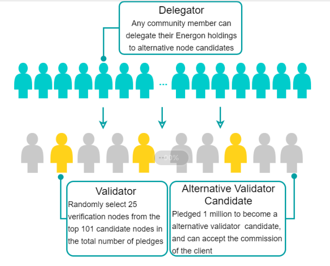
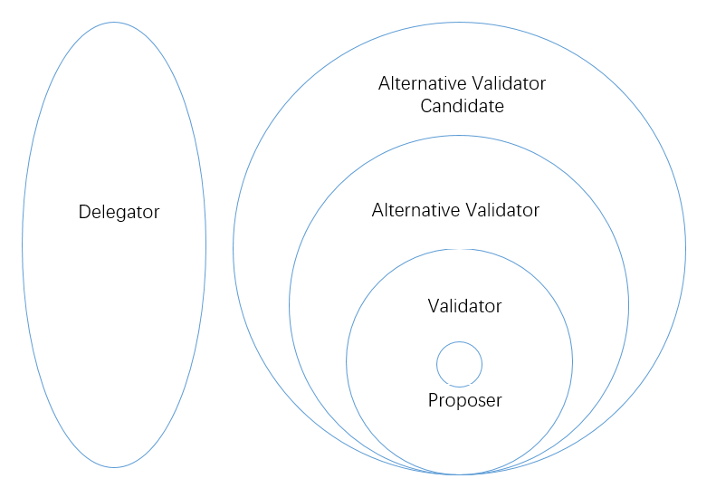
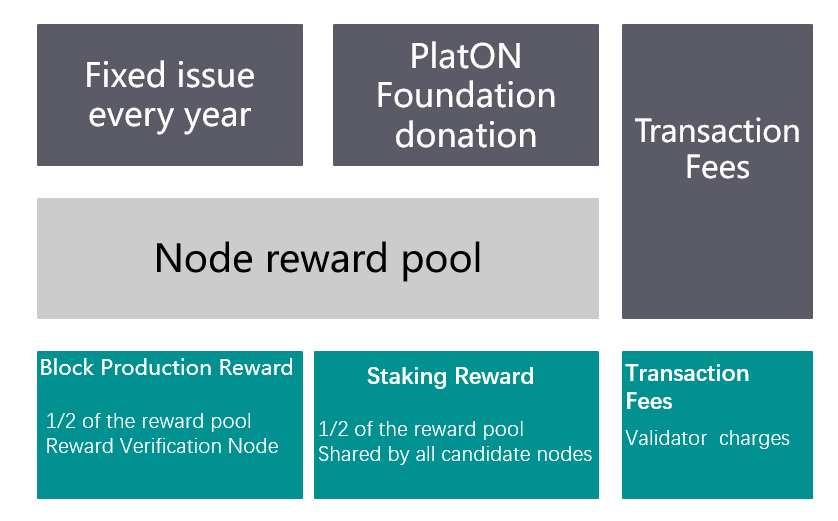

## PlatON Verification Node Introduction

### 1 What is a validation node

PlatON is a blockchain project that implements democratic governance. Verification nodes are jointly selected by all Energon holders to maintain and develop the PlatON network. The 101 nodes with the most votes will become candidate nodes, from which 25 verification nodes will be randomly selected using the VRF algorithm to participate in managing the entire PlatON network. The verification node will be responsible for:

- Maintain PlatON nodes and networks
- Production and verification blocks
- Participate in proposal voting decisions

### 2 Basic requirements for becoming a validator

#### 2.1 Minimum Pledge Requirements

The minimum pledge requirement is 1 million Energon. Pledges can be increased, but all pledges can only be cancelled all at once.

#### 2.2 Hardware requirements

- Server: The server running the PlatON software and the backup server (both need to have a firewall)
- Memory: 8GB RAM
- Local storage: 512GB SSD, support dynamic expansion, single volume capacity up to 16TB
- Processor: 64-bit 4 cores (2.4 GHz or more per core)
- Bandwidth: 100 Mbps

#### 2.3 Software Requirements

It is recommended to use Ubuntu 18.04, as this version is fully tested.

#### 2.4 Operational requirements

- Network monitoring and real-time support
- 99.9% uptime
- Cross-region failover and data backup
- Security measures
- Support software upgrade

### 3 How to become a verification node

- Candidate node candidates

    Energon holders who want to participate in the production of the PlatON block, pledge to lock a certain number of Energon (minimum pledge threshold is 1 million) into the pledge contract and become candidate node candidates. The number of candidate node candidates is unlimited and can be commissioned .

- Alternative nodes

    According to the total number of votes (the sum of their pledges and the number of other clients' commissions), the candidate node ranked in the top 101 is called the candidate node. The candidate node participates in the verification node election of each consensus cycle and can get Staking. reward.

- Verification node

    For each consensus cycle (round of 250 blocks), 25 nodes are randomly selected among the 101 candidate nodes as the consensus cycle verification node according to the weight of the total votes obtained.

- Proposer

  A consensus cycle produces 250 (25 verification nodes * each verification node produces 10 blocks in succession) blocks, 25 verification nodes take turns to become the proposer, and the block production time of each verification node is 20 seconds.

- Client

  Energon owns Energon holders of candidate node candidates. Validation nodes cannot delegate each other or self-delegate.

The role relationship diagram is as follows. **For ease of description and understanding, candidate node candidates include candidate nodes and verification nodes. Candidate nodes include validation nodes.**

### 4 How to participate in governance

In PlatON, governance is implemented by voting on-chain proposals, and there are the following types of proposals:

- Software upgrade proposal: used to initiate version upgrade voting on the chain to achieve the purpose of smooth upgrade.

- Parameter modification proposal: used to modify manageable parameters such as system parameters.

- Cancel proposal: Used to cancel the software upgrade or parameter modification proposal that is being voted on the chain.

The basic process of proposal governance is as follows:

- After submitting all draft proposals to the Github PIPs proposal repository in the form of a Pull Request, the GitHub proposal sponsor will create a proposal on the chain after full discussion in the community.
- All candidate nodes can participate in the proposal by voting on the chain, and each proposal can only vote once.
- For the upgrade proposal, the candidate node must initiate a voting transaction after upgrading the local node within the voting cycle.
- After the voting for the upgrade proposal is passed, the candidate nodes that have not been upgraded will be demoted to candidate candidates, no longer participating in consensus, and the settlement cycle in which the demotement is made will not receive Staking rewards.
- All candidate node candidates need to upgrade the local node concurrent version declaration transaction in order to participate in the ranking and become a candidate node.

### 5 What rewards can I get

#### 5.1 Reward Pool

The reward pool consists of two parts:

- Additional issuance: 2.5% of the total amount of the year before the issuance, and 80% of the additional issuance (that is, 2% of the total amount) are entered into the reward pool
- Foundation donation: equivalent to 3.01% of the total initial allocation, distributed within the first 10 years, keeping the node reward pool unchanged every year

#### 5.2 Node Reward

Node rewards consist of three parts:

- Block reward: For each successful block production, the verification node will get a fixed amount of Energon as a reward. 1/2 of the total node reward pool each year is used as a block reward, which is distributed evenly based on the number of blocks (15,759,500) per year.
- Handling fees: All handling fees for packaging transactions are charged by the verification node of the packaging block.
- Staking reward: 1/2 of the total node reward pool is used as Staking reward, and it is evenly distributed according to the number of annual Staking cycles (1466). After each Staking cycle (10,750 blocks), it is evenly distributed to all candidate nodes (including verification) node)

#### 5.3 Client Reward

Staking rewards are issued to verification nodes and candidate nodes, which are allocated by the verification node and candidate nodes to relevant principals.

#### 5.4 Estimated earnings and rewards

It is estimated that the Energon that can be staking in the first year of the launch is 8,500,000,000. Assuming a Staking ratio of 40%, for example:

| Number of single node pledges | Number of nodes | Pledge ratio | Block rewards | Staking rewards | Total rewards | Rate of return |
| ----------------------------- | --------------- | ------------ | ------------- | --------------- | ------------- | -------------- |
| 40,000,000                    | 10              | 1.18%        | 1,551,572     | 1,298,098       | 2849670       | 7.12%          |
| 35,000,000                    | 50              | 1.04%        | 1,357,626     | 1,298,098       | 2655724       | 7.59%          |
| 30,000,000                    | 41              | 0.89%        | 1,163,679     | 1,298,098       | 2461777       | 8.21%          |
| 20,000,000                    | 1               | N / A        | N / A         | N / A           | N / A         | N / A          |

(The transaction fee is not calculated here, the actual income is higher. The actual income will also vary with the pledge situation and block production situation)

- Each year for the first 10 years is guaranteed to be no less than 250 million for verification node incentives, of which 1/2 is used for block rewards and 1/2 is used for Staking rewards
- For each consensus cycle, 25 nodes are randomly selected from the top 101 nodes to participate in consensus, and the number of production blocks is directly proportional to the number of votes obtained
- Staking rewards are evenly distributed to all candidate nodes
- Nodes after ranking 101 do not participate in consensus, cannot participate in block generation and receive block rewards, and cannot receive Staking rewards

### 6 What actions will be punished

#### 6.1 Penalties

There are two penalties in PlatON:

- Cancellation of verification node qualification: Forcibly release the pledge and kick out the candidate node candidate ranks. Staking rewards are not allocated in the last settlement cycle. The pledged Energon will be returned to the original pledge account after 28 settlement cycles. Nodes cannot be re-pledged to become candidate node candidates.
- Deducted Energon: Deduct Energon directly and put it into the reward pool for the next year's block production and Staking rewards.

#### 6.2 Zero block

After being selected as a verification node, within a consensus period, if no block is produced or all blocks produced are not confirmed by other verification nodes, it is considered as a zero-out block.

The zero-block behavior is identified and penalized by the verification node in the next consensus cycle, and the verification node is disqualified by the penalty method. At present, the pledge deposit is not deducted (adjustment may be made before the mainnet goes live).

#### 6.3 Double Out or Double Sign

In the case of producing or signing multiple blocks at the same block height, in addition to canceling the verification node qualification, a 0.1% deduction (which may be adjusted before the mainnet launch) is required to pledge Energon as a penalty.

Double-out or double-sign can be reported by anyone, but not self-reported. After the current verification node verifies and reaches a consensus, the person being reported will be identified as a violation and punished. 50% of the penalty (which may be adjusted before the mainnet is online) is given to the reporter, and 50% is placed in the reward pool for block production and Staking rewards in the second year.