[TOC]

# **PlatScan Browser User Manual**

## 1. Browser selection

Please use Google Chrome or IE browser (IE 11 or above) to access. Other browsers or lower versions of IE will encounter compatibility issues such as pages not displaying, displaying incompletely, and being unable to click.

## 2. Enter the PlatScan website

The following methods are supported to access the PlatScan website:

(1) Search engine: use Google, Baidu, Yahoo, Yandex, Bing, naver, Goo and other search engines to search: PlatScan or PlatON Block Explorer (PlatON Block Explorer), etc., enter the website from the search results (not online, not support).

(2) Enter from the PlatON official website, click the PlatScan navigation link at the bottom or the PlatScan introduction page of build in PlatON to enter the website (not officially launched, not supported for the time being).

(3) Enter the URL to enter:

- Mainnet (current Rally NewBaleyworld): <https://platscan.platon.network/>

- Test network (not available):<https://platscan.test.platon.network>

(4) Entry of other publicity materials

## 3. Product Features

### 3.1 Home

Enter the PlatScan website, the default is "Home":

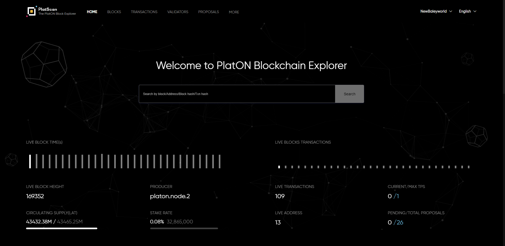

(1) The top navigation bar: browser information navigation bar, click to switch; the top right side supports language switching: Simplified Chinese, English; network switching: main network and test network (currently only supports Rally NewBaleyworld network);

(2) Search: Support input "block height" and "block hash" to query block details, enter "transaction hash" to query transaction details, and enter "account address" to query account details;

(3) Statistical chart: real-time display of the histogram of the block length of each block. Display the histogram of the transaction number of each block in real time;

(4) Statistical indicators: real-time display of "current block height", "node name of the block", "circulation and total circulation", "pledge rate and total pledge", "real-time transaction number", "current And historical largest transactions TPS "," Number of account addresses with transactions "," Number of proposals in progress and total proposals ".

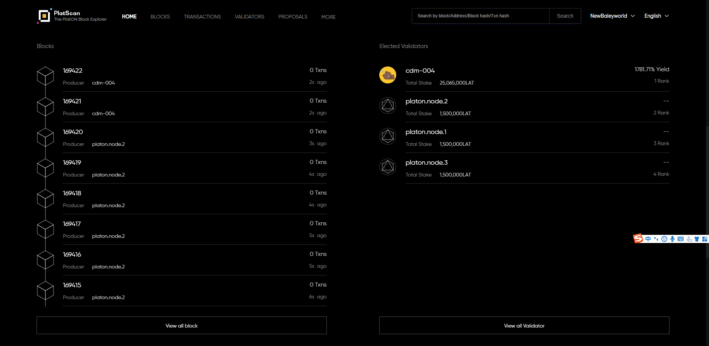

(5) Block: real-time display of block information (including block height, block generating node, number of block transactions, block age (indicating the interval between the block generation time and the current time)). Click "View All Blocks" to link to the "Blocks" display page.

(6) Elected verification node: Shows the verification nodes of the current consensus cycle (including node avatar, verification node name, total pledge amount, estimated annualized rate, ranking). Click to view "All Validation Nodes" to link to the "Validation Nodes" display page.

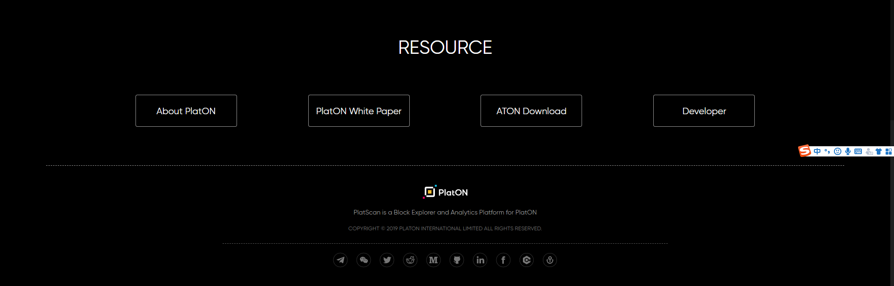

(7) Resources: Click "About PlatON" to link to the official website; click "PlatON White Paper" to link to the PlatON white paper page; click "ATON Download" to link to the ATON download page on PlatON's official website; click "Developer" to link to Developer page.

(8) Bottom community: Click on each community icon to link to the corresponding official community website.

 

### 3.2 Blocks

Block, showing a list of all produced blocks. The list contains the block height (click the "block height" information to enter the block details), the block age, the number of transactions in the block, the block size, and the block generating node (click the "block generating node" to enter the block generating node details ), Fuel consumption (gas consumed in the current block), block rewards.

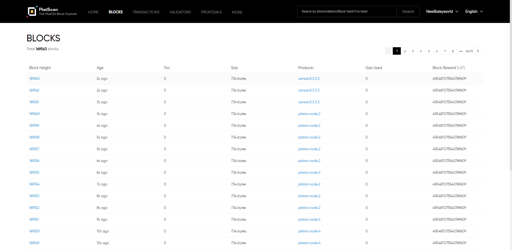

 

#### 3.2.1 Block Details

Block details, showing the block information of the current block and the transaction list information within the block.

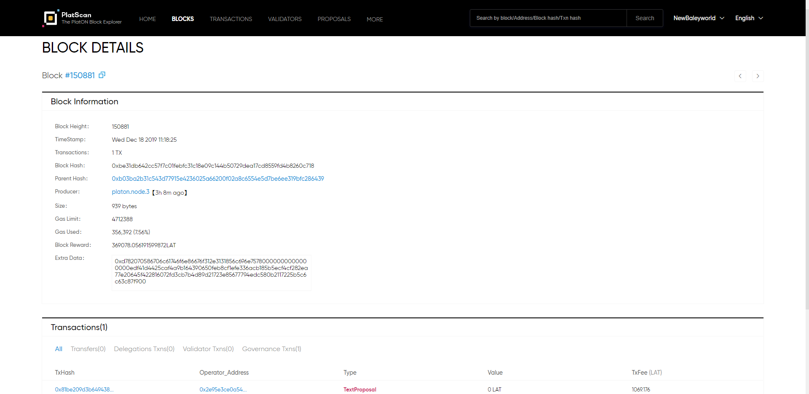

(1) Block information: block height, block timestamp, number of transactions in the block, block hash, previous block hash (click to jump to the previous block details), block node (click to enter Node details), block size, fuel limit, fuel consumption and proportion, block rewards, additional data.

(2) Transaction list: display all transactions in the current block, and support filtering based on classification. The transaction list includes: transaction hash (click to jump to transaction details), operation address (click to jump to account address details), transaction type, value (value of transaction transfer), and transaction fees.

 

### 3.3 Transactions

Transactions, showing a list of all packaged confirmed transactions. The list contains transaction hash (click to enter transaction details), block (click to enter block details), block age, operation address (click to enter account address details), transaction type, value (value of transaction transfer value), and transaction fees.

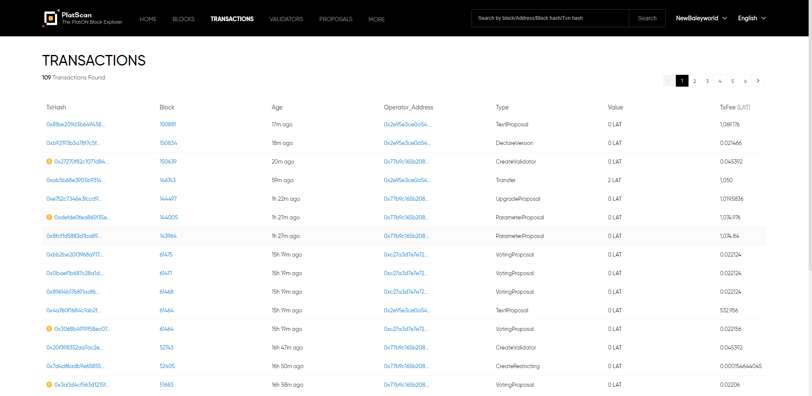

 

#### 3.3.1 Transaction Details

Transaction details, showing detailed transaction content and basic transaction information of different transaction types.

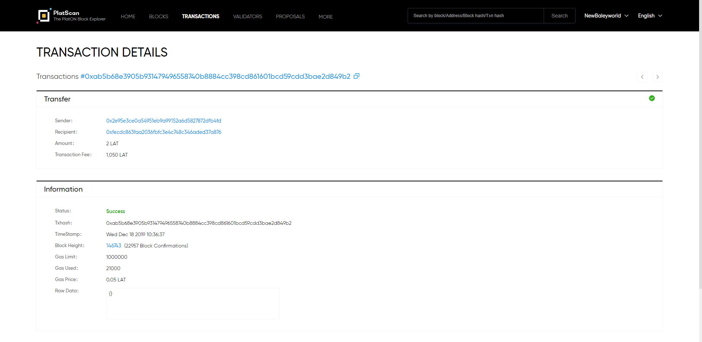

 

Transaction information, showing the basic information of the transaction: including status, transaction hash, time stamp, block (click to enter block details), fuel limit, fuel consumption, fuel price, transaction data.

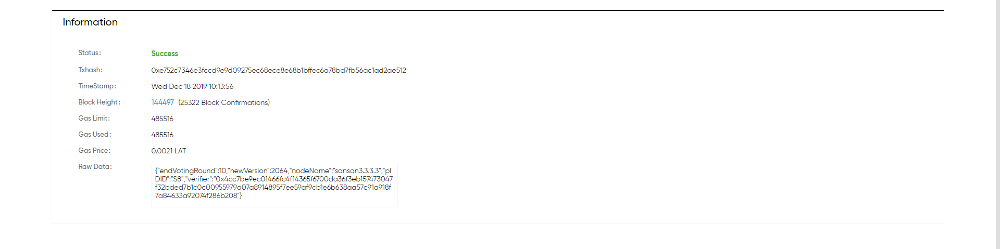

**The specific transaction content is displayed according to different transaction types:**

(1) Transfer: sender (click to enter account address details), receiver (click to enter account address details), transfer amount, transaction transaction fee.

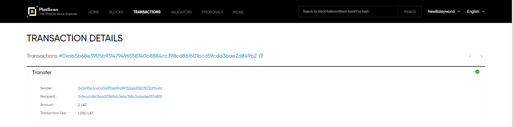

(2) Create verification node: name of verification node (click to enter verification node details), operation address of verification node (ie pledge wallet account address, click to enter account address details), identity authentication ID (click to jump to third-party keybas personal homepage) ), Reward account (address of the account where the verification node receives revenue, click to enter the account address details), version (the version number of the verification node's operation), official website (the official website address of the verification node), description (the description information of the verification node), pledge Quantity, transaction fee for creating a verification node.

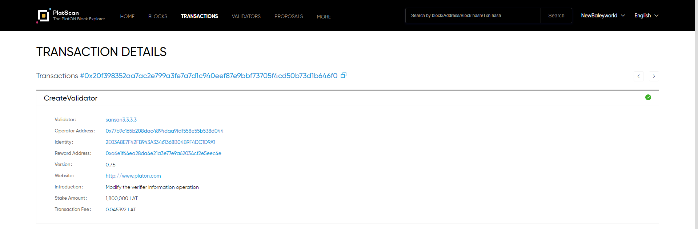

 

(1) Edit verification node: verification node name (click to enter verification node details), verification node operation address (ie pledge wallet account address, click to enter account address details), identity authentication ID (click to jump to third-party keybase personal homepage ), Reward account (address of the account that the verification node receives the revenue, click to enter the account address details), official website (the official website address of the verification node), description (the description information of the verification node), the transaction fee for editing the verification node information.

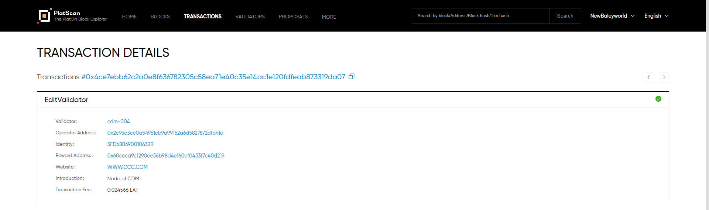

 

(4) Add own pledge: verification node name (click to enter verification node details), verification node operation address (ie pledge wallet account address, click to enter account address details), amount of pledge, transaction fee for creating verification node

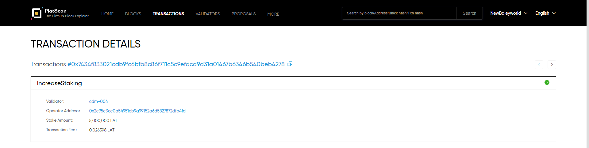

(5) Entrustment: the address of the principal (click to enter the account address details), the name of the verification node to be entrusted (click to enter the details of the verification node), the number of orders, and the transaction fee for the order.

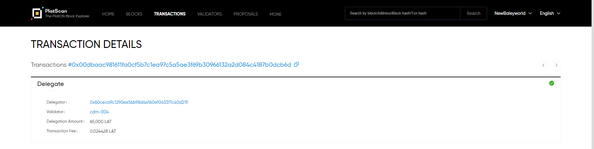

 

(6) Redemption commission: client address (account address, click to enter account address details), commissioned verification node name (click to enter verification node details), redemption amount, transaction commission for redemption commission.

 

(7) Creating proposals: Creating proposals includes creating text proposals, creating parameter proposals, creating upgrade proposals, and creating cancellation proposals. Create proposal transaction information includes: the name of the proposer (the name of the verification node, click to enter the verification node details), the operation address of the verification node (that is, the pledge wallet account address, click to enter the account address details), the proposal type, and the proposal ID (that is, the creation Proposal transaction hash), PIP number (PIP number assigned by the GitHub Proposal Library, click to enter the GitHub proposal details of the proposal), title (proposal name, click to enter the browser's proposal details), transaction fees for creating corresponding types of proposals.
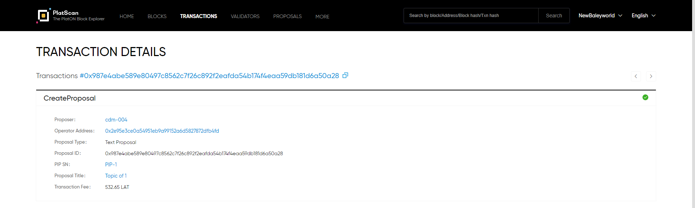

(8) Version declaration: the name of the verification node (the name of the verification node, click to enter the verification node details), the operation address of the verification node (that is, the pledge wallet account address, click to enter the account address details), the version of the statement (the version number of the node operation) Transaction fee for version statement.

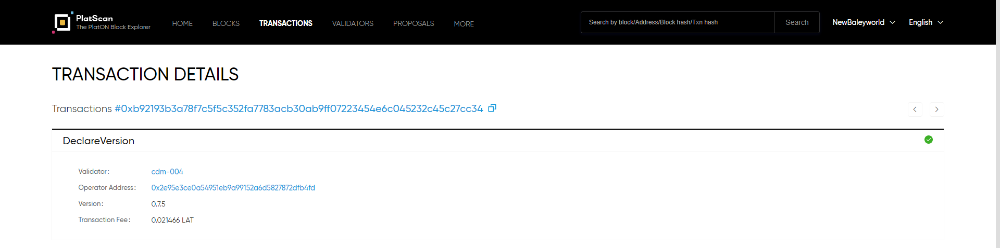

 

(9) Proposal voting: verification node name (name of verification node, click to enter verification node details), operation address of verification node (ie pledge wallet account address, click to enter account address details), proposal type, proposal ID (that is, the creation The hash address of the proposal), PIP number (PIP number assigned by the GitHub proposal library, click to enter the GitHub proposal details of the proposal), title (proposal name, click to enter the browser's proposal details), voting (voting options), proposal voting Transaction fee.

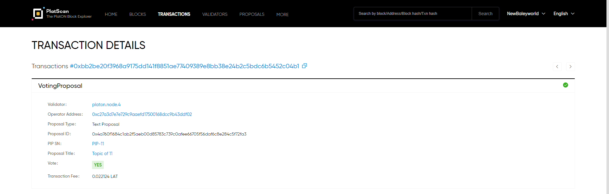

(10) Report verification node: Reporter address (account address, click to enter account address details), verification node name (reported verification node name, click to enter verification node details), report type, report evidence, report result (whether successful or failure), reporting rewards (reward amount obtained by the reporter successfully reporting), reporting transaction fees of the verification node.

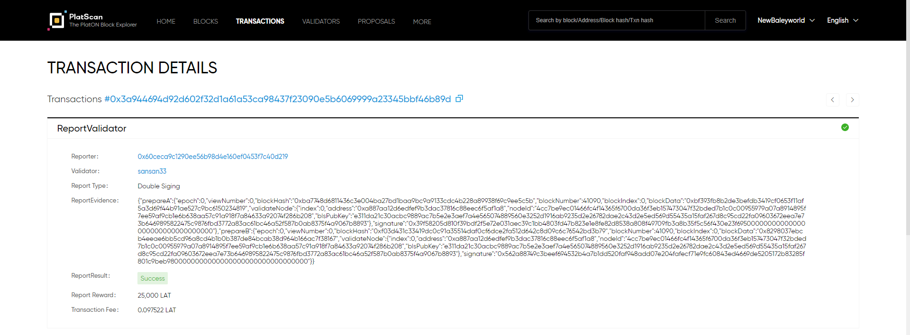

 

(11) Exit verification node: name of verification node (name of verification node, click to enter verification node details), operation address of verification node (ie pledge wallet account address, click to enter account address details), return amount (returned amount of pledge), Expected transaction block (locked pledge, additional 28 settlement cycles frozen), transaction fee for withdrawal from verification node.

(12) Creating a hedging position: the sender's address (the account address sent by the hedging, click to enter the account details), the hedging address (the address participating in the hedging), the hedging plan, and the transaction fee for creating the hedging.

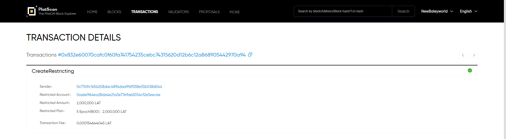

 

#### 3.3.2 Account address details

Address details, showing basic address information, transaction records and commission statistics.

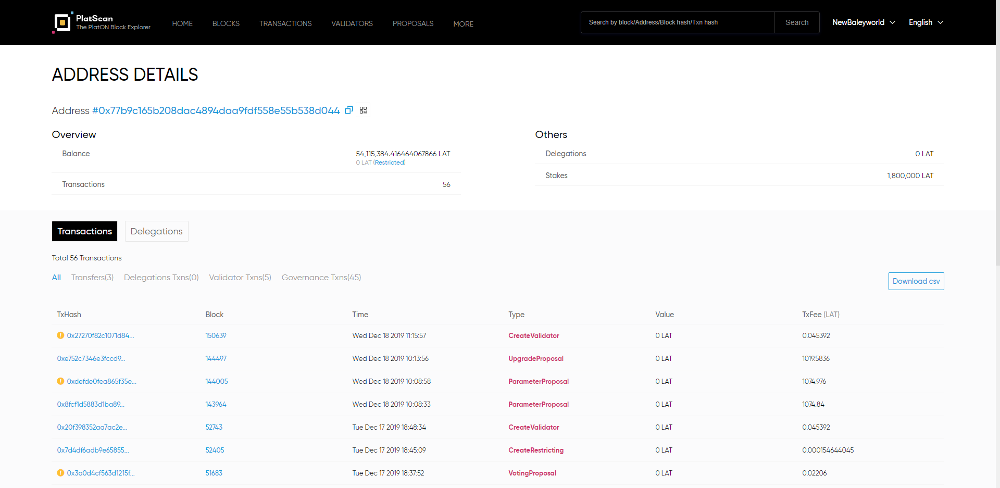

 

(1) Account address overview, showing account address balance, number of transactions, commission amount, and pledge amount.

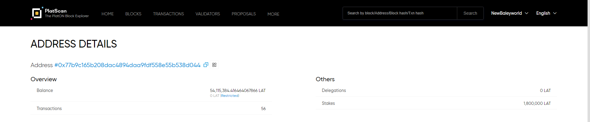

If the current account address is involved in hedging, the hedging balance is displayed. Click to enter the hedging details:

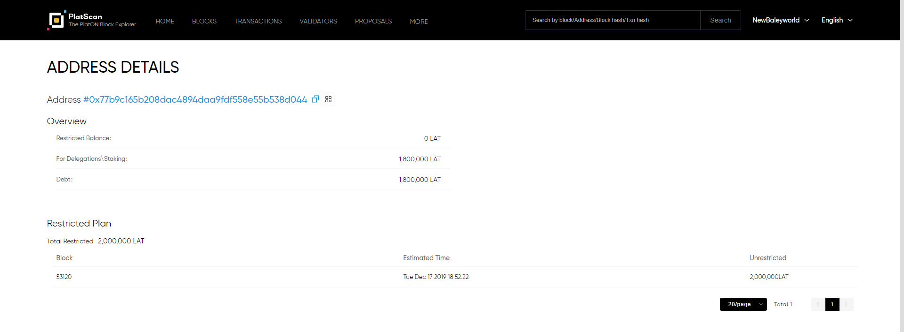

(2) Transactions: Show all transactions under this address, and support filtering based on classification. The transaction list includes: transaction hash (click to jump to the transaction details), block (the block to which the transaction belongs, click to enter the block details), confirmation time (that is, the time for the transaction to package the block), transaction type, value, and transaction cost .

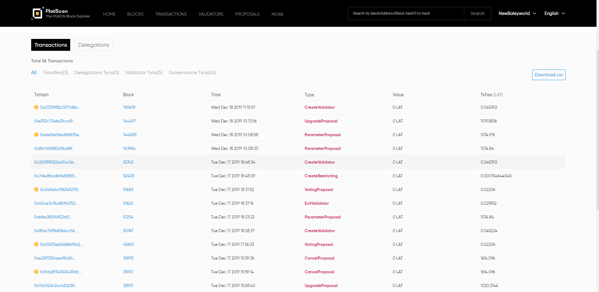

Support CSV format download. The download requires Google security verification, and a maximum of 30,000 pieces of data can be downloaded at a time. (Note that domestic Google verification needs to be over the wall).

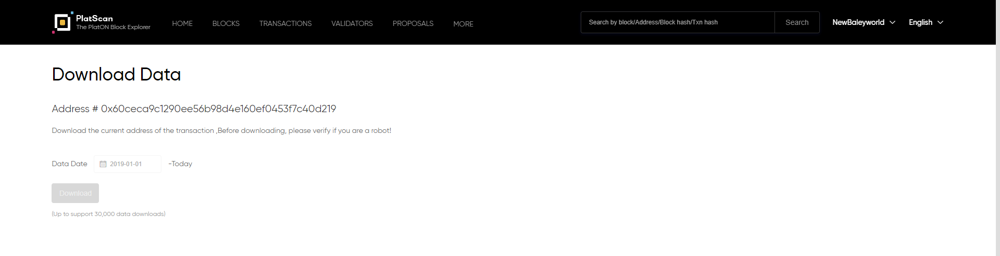

(3) Commission: Show the commission statistics and commission records of the account address.

The entrusted statistics include the number of currently verified nodes, the number of entrusted locks, the number of entrusted unlocks, and the number of entrusted pending redemptions.

The delegation record contains: verification node (name of the verification node, click to enter the details of the verification node), number of delegations (locked + unlocked quantity), locked delegations (the number of delegations that the account address has been locked under this node), unlocked delegations Quantity, number of commissions to be redeemed.

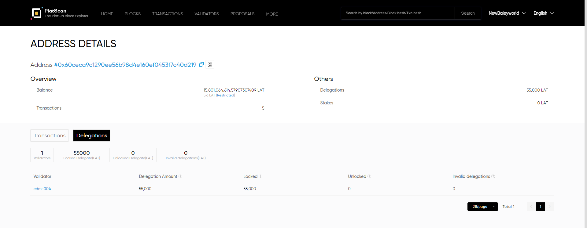

 

 

 

### 3.4 Verify Node

Validation node, displaying the list of validation nodes and the real-time pledge reward information of the validation nodes at the current stage of the network.

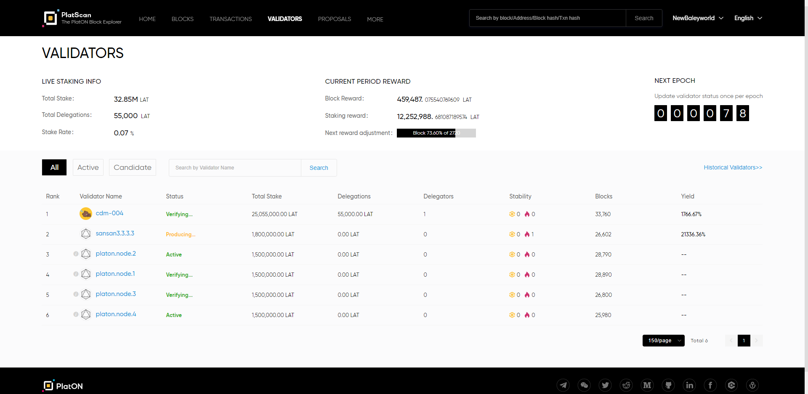

 

(1) Real-time pledge information: display the total pledge, the total amount of commissions accepted, and the pledge rate (the total pledge accounts for the total real-time issuance);

This week's reward: block rewards (the number of rewards for each block in the current issuance cycle), pledge rewards, and the next reward adjustment period (each additional issuance cycle, the above rewards will be recalculated. Showing the blocks that have been produced in the current issuance cycle) number);

The next settlement cycle: countdown of the settlement cycle, update the verification node status once every settlement cycle.

 

(2) Filter and search for verification node list:

Support screening, all, active (candidate nodes, including blocks), candidates (candidate node candidates);

Support search, enter the verification node name to search for verification nodes.

 

(3) Verification node list, the fields include: ranking, verification node name (click to enter verification node details), status, total pledge, number of delegates, principal, stability (low block rate, double signing times), generated The number of blocks, the estimated annualized rate (the annualized rate of income of the current node).

 

#### 3.4.1 Verification Node Details

Details of the verification node, showing the statistics information of the verification node, the basic information of the node, the block list, the record of the behavior of the verification node, and the delegation record (the information of the delegation record received by the verification node).

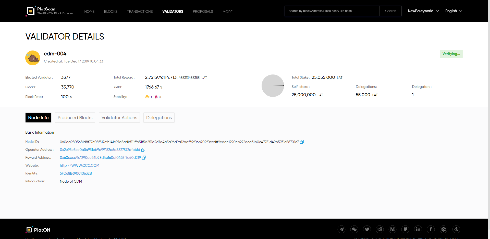

Statistics of verification nodes: Contains the number of verification nodes in the elected consensus cycle, the cumulative number of blocks, the rate of block production, the cumulative reward, the estimated annualized return rate, the stability, the pie chart of the total pledge distribution of the nodes, the total pledge, and the node's own The number of pledges, the number of commissions received by the node, and the number of commissioners.

 

**(1) Node information**

Display the node information submitted by the verification node. Including, node ID (same node public key), operation address (that is, the account address of the pledged LAT, click to enter the account address details), reward account (that is, verify the node account that receives the reward, click to enter the account address details), the official website (verification The official website submitted by the node, click to enter the website), identity ID (64-bit public key of keybase website, click to jump to the user's keybase personal homepage), description (brief description information of the submitted verification node).

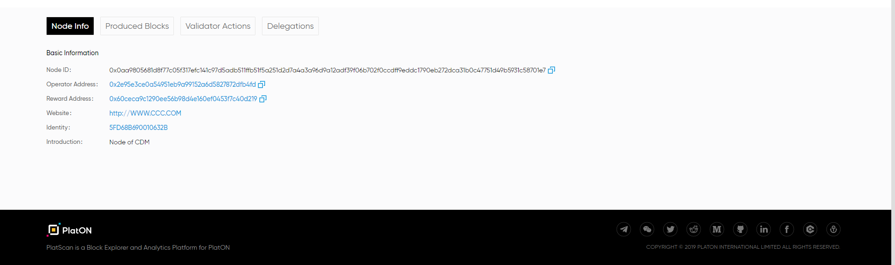

 

**(2) Blocks have been issued**

Display the list of blocks produced by the verification node. The block list includes block height (click to enter block details), block production time, number of transactions (number of transactions in the block), and block rewards (block rewards for the block).

Supports downloading block records in CSV format. The download requires Google security verification, and a maximum of 30,000 pieces of data can be downloaded at a time. (Note that domestic Google verification needs to be over the wall).

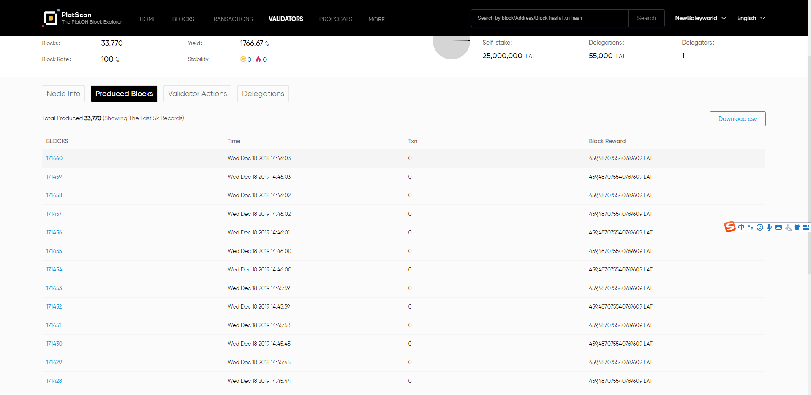

 

**(3) Node behavior**

Show the behavior record of the verification node. The active actions of the verification node include: creating a verification node, editing a verification node, exiting the verification node, creating a proposal, and voting for a proposal. The passive behavior of the verification node includes: low block rate penalties and double sign penalties.

The list fields include time, operation content, belonging transaction (behavior, no transaction record), and belonging block.

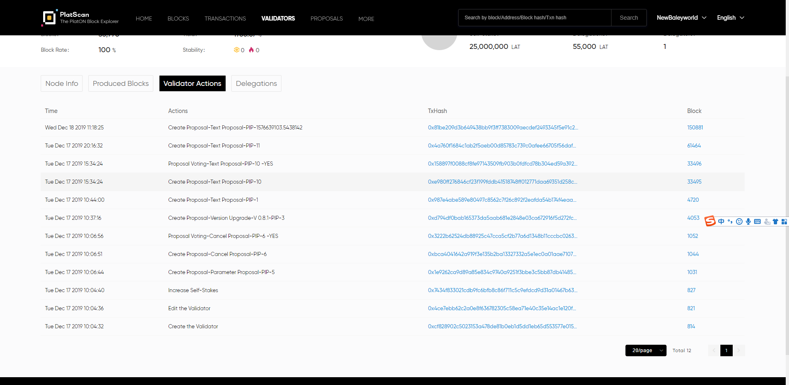

 

**(4) Commissioned**

 Display the delegation information received by the verification node. The commission information includes: the client (account address, click to enter the account address details), the number of commissions \ proportion (the number of commissions of the current client, the proportion of the number of commissions to all the number of commissions under the verification node), the locked commission (the current commission The number of people's entrustment has been locked), the number of entrusted to be redeemed (the number of entrustment that the entrusted party has expired and is waiting to be redeemed)

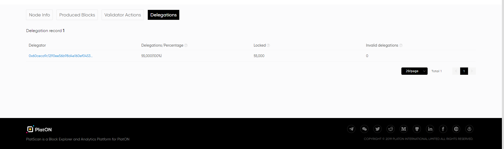

 

### 3.5 Governance proposal

Governance proposals, showing all submitted proposals.

Proposal list contains: PIP number (PIP number assigned by GitHub proposal library, click to enter the proposal details in GitHub), title (proposal title of the proposal in GitHub, click to enter the proposal details displayed in PlatScan), proposal type (including: upgrade Proposal, Cancel Proposal, Text Proposal, Parameter Proposal), Status, Voting End Block (Voting Progress), Proposal Time.

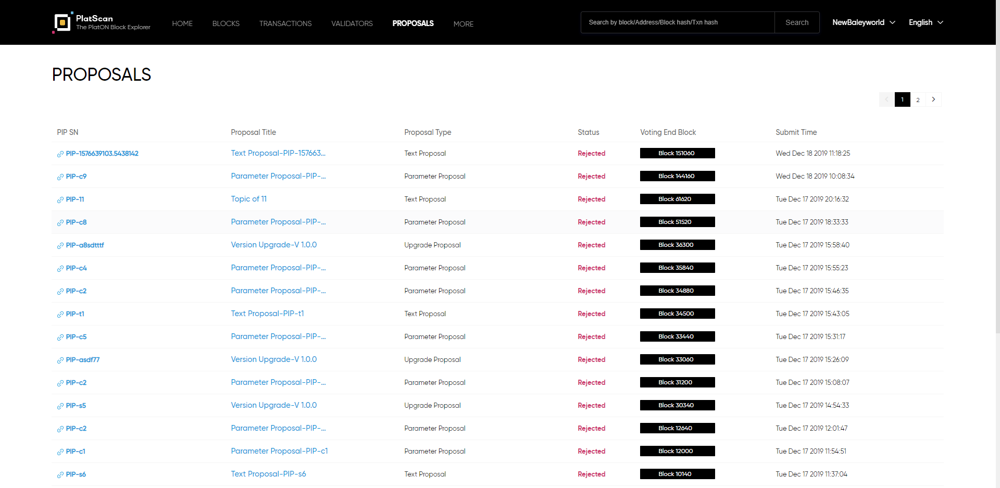

 

 

#### 3.5.1 Proposal Details

Proposal details, showing the basic information of the proposal, voting information and voting records

Different proposal types, slightly different

 

**(1) Upgrade proposal**

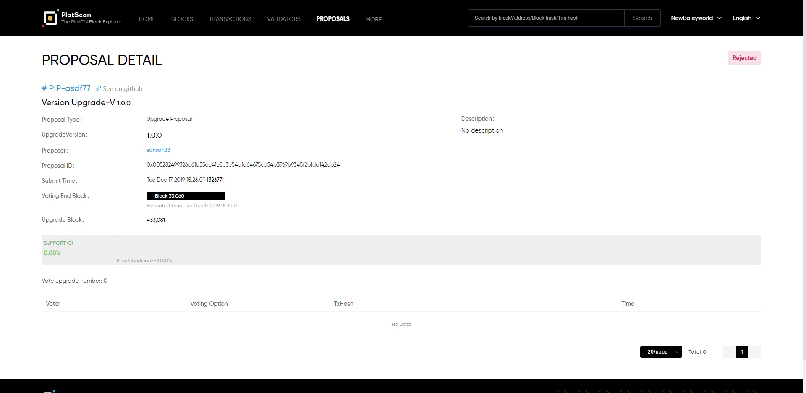
Basic information of upgrade proposal: proposal PIP number (PIP number assigned by GitHub proposal library, click to enter the proposal details in GitHub), proposal title, proposal type-upgrade proposal, upgrade version, sponsor (name of the verification node, click to enter verification Node details), proposal ID (ie transaction hash), proposal time, voting end block, preset upgrade block, proposal description (proposal description in GitHub).

 Voting information: the current percentage of support (at the end of voting, when the voting results meet the conditions for approval, the proposal is approved).

 Voting records: Contains the voter (account address, click to enter account address details), voting options, transaction hash (vote transaction hash, click to enter voting transaction details), and voting time.

 

**(2) Cancel proposal**

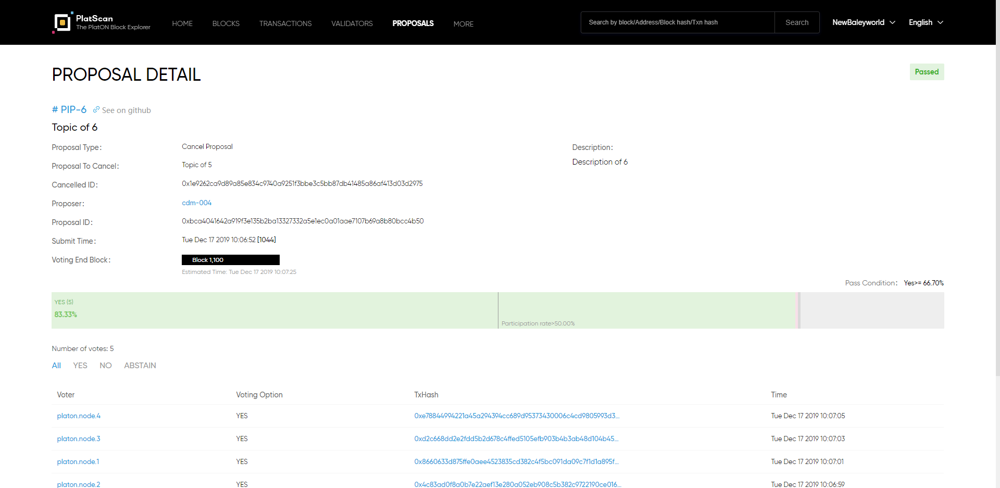

Cancel proposal is used to cancel the promotion proposal or parameter proposal in the current vote.

Cancellation proposal basic information: proposal PIP number (PIP number assigned by GitHub proposal library, click to enter the proposal details in GitHub), proposal title, proposal type-cancel proposal, canceled proposal (show canceled proposal title), cancelled Proposal ID (that is, the canceled proposal creates a transaction hash), the proponent (the name of the verification node, click to enter the verification node details), the proposal ID (that is, the transaction hash), the proposal time, the voting end block, the proposal description (in GitHub Proposal description).

 Voting information: Current voting percentages of YES, NO, and ABSTAIN (at the end of voting, when the voting result meets the participation rate requirements and Yes approval conditions, the proposal is approved).

 Voting records: support screening. The record contains fields, voter (account address, click to enter account address details), voting options, transaction hash (vote transaction hash, click to enter voting transaction details), and voting time.

 

**(3) Text proposal**

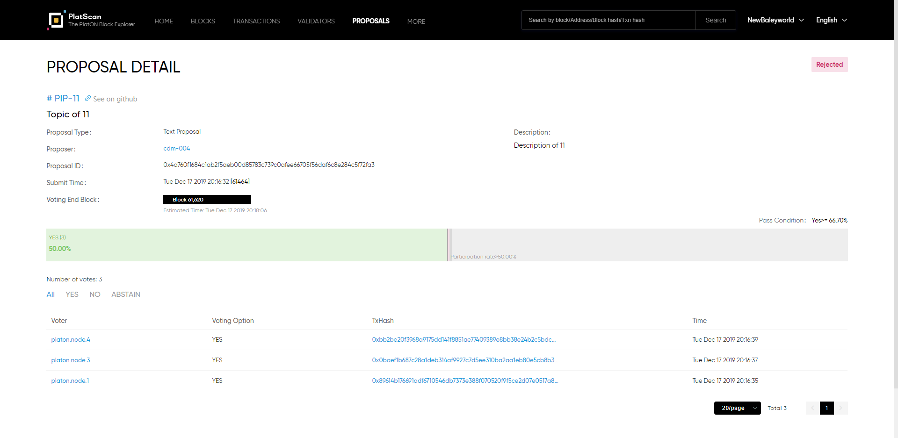

Text proposal basic information: proposal PIP number (PIP number assigned by GitHub proposal library, click to enter the proposal details in GitHub), proposal title, proposal type-text proposal, sponsor (name of the verification node, click to enter verification node details) , Proposal ID (ie transaction hash), proposal time, voting end block, proposal description (proposal description in GitHub).

Voting information: Current voting percentages of YES, NO, and ABSTAIN (at the end of voting, when the voting result meets the participation rate requirements and Yes approval conditions, the proposal is approved).

Voting records: support screening. The record contains fields, voter (account address, click to enter account address details), voting options, transaction hash (vote transaction hash, click to enter voting transaction details), and voting time.

**(4) Parameter proposal**

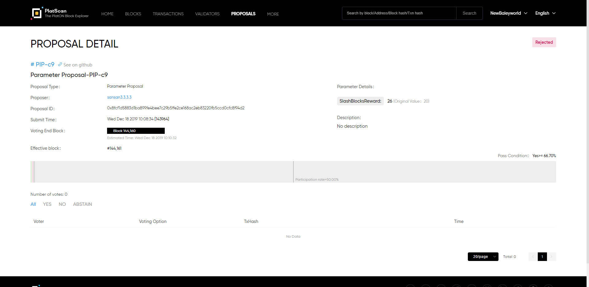

Parameter proposal basic information: proposal PIP number (PIP number assigned by GitHub proposal library, click to enter the proposal details in GitHub), proposal title, proposal type-parameter proposal, sponsor (name of the verification node, click to enter verification node details) , Proposal ID (ie transaction hash), proposal time, voting end block, parameter effective block, parameter details (showing the parameter names and parameter values that need to be modified for the current proposal, and showing the original parameter values), the proposal description (the proposal in GitHub description).

Voting information: Current voting percentages of YES, NO, and ABSTAIN (at the end of voting, when the voting result meets the participation rate requirements and Yes approval conditions, the proposal is approved).

Voting records: support screening. Record contains fields, voter (account address, click to enter account address details), voting options, transaction hash (investment
Ticket transaction hash, click to enter voting transaction details), voting time.

### 3.6 More

#### 3.6.1 Manageable parameters

Shows the manageable parameters currently supported by the PlatON network and the current and initial values of the corresponding manageable parameters.

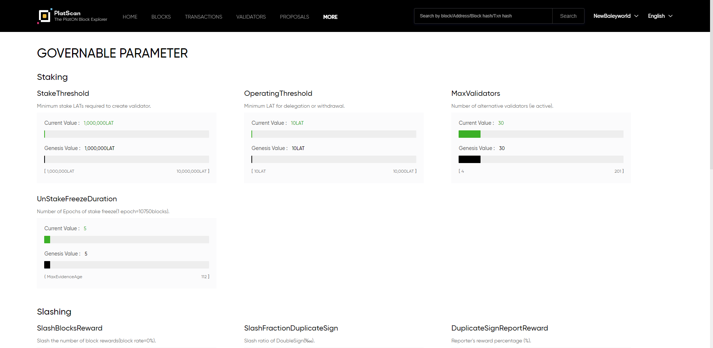

(1) The Staking module contains the following manageable parameters:

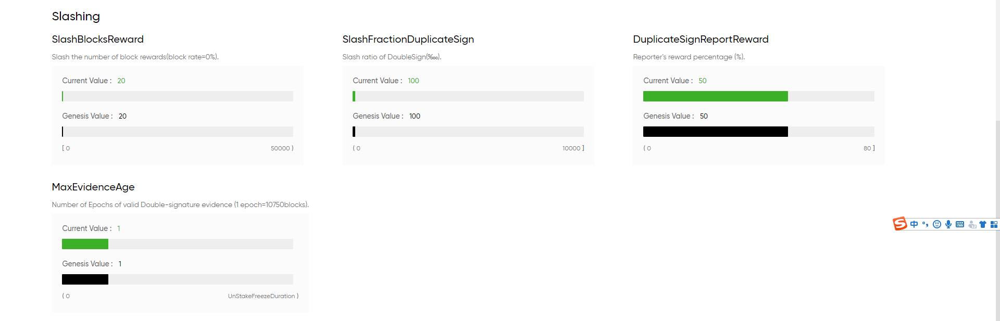

(2) The Slashing module contains the following manageable parameters:

 (3) Block module contains the following manageable parameters:

